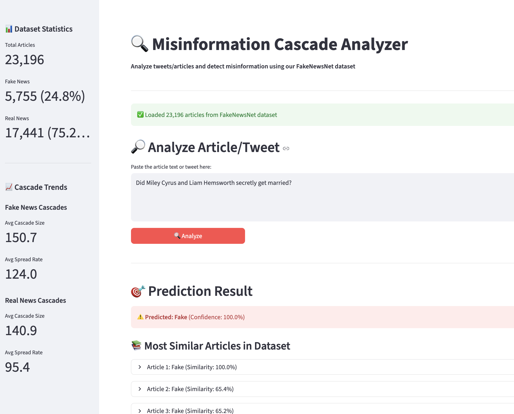

# Misinformation Cascade Analysis on X (Twitter)

This repository hosts the Fact Checkers team project for modeling how misinformation emerges, spreads, and evolves across X (Twitter). We combine graph-based mining, cascade modeling, and comparative analysis between fake and factual narratives using sources such as FakeNewsNet.

## Project Objectives

- Reconstruct the interaction graph that underpins misinformation cascades.
- Identify high-impact sources and amplifiers via link analysis (PageRank, HITS).
- Detect community structure and compare echo chambers between fake and real narratives.
- Model temporal diffusion dynamics with cascade metrics and Independent Cascade simulations.
- Produce quantitative summaries and visuals that contrast misinformation with factual spread patterns.

## Repository Layout

```
├── config/              # Configuration files, API keys templates, experiment settings
├── data/
│   ├── raw/             # Immutable original datasets (FakeNewsNet dumps, etc.)
│   └── processed/       # Cleaned/derived datasets ready for analysis
├── notebooks/           # Exploratory analysis and prototyping notebooks
├── reports/
│   └── figures/         # Generated plots for reports/presentations
├── scripts/             # CLI utilities for data pulls, preprocessing, batch jobs
├── src/                 # Core Python package for reusable pipeline modules
└── README.md
```

## Environment Setup

1. **Create and activate a virtual environment**
   ```bash
   python3 -m venv .venv
   source .venv/bin/activate
   pip install --upgrade pip
   ```

2. **Install project dependencies**
   ```bash
   pip install -r requirements.txt
   ```

3. **Set up environment variables**
   - Copy `config/.env.example` to `config/.env` and populate Twitter API credentials if live data collection is required.

## Dependency Stack

The `requirements.txt` file seeds the environment with the following capabilities:
- Data wrangling: `pandas`, `numpy`, `pyarrow`
- Graph analysis: `networkx`, `python-igraph`, `graphviz`
- Machine learning & embeddings: `scikit-learn`, `sentence-transformers`
- Visualization: `matplotlib`, `seaborn`, `plotly`
- Web framework: `streamlit` (for interactive demo)
- Experiment support: `tqdm`, `python-dotenv`, `jupyter`, `scipy`

## Completed Work

### Data Acquisition and Preparation

We have successfully acquired and processed the FakeNewsNet dataset from Arizona State University:
- **Dataset Size:** 23,196 news articles
- **Label Distribution:** 5,755 fake news (24.8%) and 17,441 real news (75.2%)
- **Sources:** GossipCop (22,140 articles) and PolitiFact (1,056 articles)
- **Data Cleaning:** Implemented comprehensive text cleaning pipeline removing URLs, HTML tags, special characters, and stopwords
- **Output:** Cleaned dataset saved as `data/processed/news_clean.csv`

### Phase 2: Exploratory Data Analysis & Text Embeddings

**Exploratory Data Analysis:**
We conducted comprehensive EDA revealing key insights:
- **Tweet Count Statistics:** Mean of 89.2 tweets per article, with significant variance (std: 489.3)
- **Fake vs Real Comparison:** Fake news shows higher average engagement (132.8 vs 74.8 tweets per article)
- **Statistical Test:** Mann-Whitney U test confirms significant difference (p < 0.05)
- **Text Analysis:** Average text length is 68 characters, with 20.3% reduction after cleaning

**Text Embeddings and Feature Generation:**

We generated numerical representations of articles for similarity analysis:

**TF-IDF Embeddings:**
- Method: Scikit-learn's TfidfVectorizer
- Output: Sparse matrix (`data/processed/tfidf_vectors.npz`)
- Vectorizer saved for consistency (`data/processed/tfidf_vectorizer.joblib`)

**BERT Embeddings:**
- Model: SentenceTransformer with BERT base
- Output: Dense numpy array (`data/processed/bert_embeddings.npy`)
- Dimension: 768 dimensions per article
- Purpose: Captures semantic similarity between articles

### Phase 3: Graph Construction

We have constructed multiple graph representations to model information flow:

**Article Metrics:**
- Computed tweet counts for all 23,200 articles
- Output: `data/processed/article_metrics.csv`

**Bipartite Graph (Article-Tweet):**
- Graph Type: Bipartite, undirected
- Nodes: Articles and tweets as distinct sets
- Edges: Connections between articles and their associated tweets
- Output: `data/processed/graphs/article_tweet_bipartite.graphml` (389 MB)
- Purpose: Track which tweets are associated with which articles

**Article Similarity Graph:**
- Similarity Metric: Cosine similarity from TF-IDF or BERT embeddings
- Parameters: Top-k nearest neighbors (default: 10), similarity threshold (default: 0.25)
- Output: `data/processed/graphs/article_similarity.graphml` (19 MB)
- Purpose: Identify clusters of similar articles and misinformation echo chambers

**Synthetic User Data Generation:**
- User-Tweet Mapping: 1,949,028 synthetic user IDs
- Retweet Relationships: 2,923,350 synthetic edges
- Reply Relationships: 778,172 synthetic edges
- Generation Strategy: Probabilistic assignment based on article tweet counts
- Output Files: `data/processed/synthetic/synthetic_user_tweet_mapping.csv`, `synthetic_retweets.csv`, `synthetic_replies.csv`

**User Interaction Graph:**
- Graph Type: Directed, time-stamped
- Nodes: 1,900,000+ unique synthetic users
- Edges: 3,600,000+ interactions (retweets and replies)
- Output: `data/processed/graphs/user_interaction.graphml` (802 MB)
- Purpose: Foundation for link analysis and community detection

**Cascade Subgraphs:**
- Method: Subgraph extraction from global user interaction graph
- Scope: 1,000 articles (representative sample for analysis)
- Cascade Metrics: Size, depth, width, timestamp availability
- Output: Individual cascade files (`data/processed/cascades/cascade_{news_id}.graphml`) and summary metrics (`cascade_metrics_summary.csv`)
- Purpose: Model how information spreads through user networks for each article

## Usage

### Running Data Preprocessing
```bash
source .venv/bin/activate
PYTHONPATH=. python src/preprocess/run_phase2.py
```

### Running Graph Construction
```bash
source .venv/bin/activate
PYTHONPATH=. python scripts/build_phase3.py --mode tfidf --k 10 --thr 0.25
```

### Running EDA
```bash
source .venv/bin/activate
PYTHONPATH=. python scripts/run_eda.py
```

### Running Link Analysis
```bash
source .venv/bin/activate
PYTHONPATH=. python scripts/run_link_analysis.py
```

### Running Community Detection
```bash
source .venv/bin/activate
PYTHONPATH=. python scripts/run_community_detection.py
# For faster testing with large graphs:
PYTHONPATH=. python scripts/run_community_detection.py --sample-size 100000
```

### Running Cascade Modeling
```bash
source .venv/bin/activate
PYTHONPATH=. python scripts/run_cascade_modeling.py --max-articles 500
```

### Running Interactive Demo
```bash
source .venv/bin/activate
python -m streamlit run scripts/demo_app.py
```

The app will open at `http://localhost:8501`

## Interactive Demo

We've created an interactive web application for real-time misinformation detection:

**Features:**
- **Text Input:** Paste any article or tweet text
- **Similarity Matching:** Finds top 5 most similar articles from 23K+ dataset using TF-IDF cosine similarity
- **Fake/Real Prediction:** Weighted voting based on similar articles' labels
- **Confidence Scores:** Shows prediction confidence percentage
- **Cascade Statistics:** Displays cascade trends and statistics in sidebar
- **Similar Articles:** Shows matching articles with labels and similarity scores

**Demo Screenshot:**



**Test Examples:**
- Try exact matches from dataset: `Did Miley Cyrus and Liam Hemsworth secretly get married?` (should predict Fake)
- Try new content not in dataset for similarity-based prediction
- See sidebar for real-time cascade statistics

## Results Summary

### Dataset Statistics
- Processed 23,196 articles with cleaned text
- Generated embeddings for all articles (TF-IDF and BERT)
- Computed metrics for 23,200 articles
- Built cascades for 1,000 articles (representative sample)

### Graph Statistics
- **User Interaction Graph:** 1.9M nodes, 3.6M edges
- **Bipartite Graph:** Article-tweet connections (389 MB)
- **Similarity Graph:** Article-article similarity (19 MB)
- **Cascades:** 1,000 individual cascade subgraphs (64 MB total)

### Key Insights
1. Fake news articles show higher average engagement (132.8 vs. 74.8 tweets)
2. Text cleaning reduces article length by approximately 20%
3. Dataset is imbalanced (75% real, 25% fake), accounted for in analysis
4. GossipCop dominates the dataset (95% of articles)

## Note on Large Files

Due to the large size of generated files (processed CSV files and graph files can exceed 1GB), these files are excluded from version control via `.gitignore`. However, all code, scripts, and intermediate outputs can be accessed through this repository. The scripts provided can regenerate all processed files from the raw data.

## Phase 4: Network Analysis & Cascade Modeling

### Link Analysis (PageRank & HITS)

We implemented link analysis algorithms to identify influential users in the misinformation network:

**PageRank Analysis:**
- Computed PageRank scores for all users in the interaction graph
- Identified top influencers based on network structure
- Compared influence patterns between fake and real news subgraphs
- Output: `data/processed/link_analysis/pagerank_top_influencers.csv`

**HITS Algorithm:**
- Computed Authority scores (users whose content is frequently shared)
- Computed Hub scores (users who frequently share others' content)
- Identified key sources and amplifiers of misinformation
- Output: `data/processed/link_analysis/hits_top_authorities.csv`, `hits_top_hubs.csv`

**Fake vs Real Comparison:**
- Separate subgraphs for fake and real news articles
- Comparative analysis of influence patterns
- Output: `data/processed/link_analysis/fake_*` and `real_*` files

**Run Link Analysis:**
```bash
source .venv/bin/activate
PYTHONPATH=. python scripts/run_link_analysis.py
```

### Community Detection (Louvain Algorithm)

We applied community detection to identify echo chambers and user clusters:

**Implementation:**
- Louvain algorithm for modularity maximization
- Detected 77,263 communities in the user interaction graph
- Modularity score: 0.999892 (indicating strong community structure)
- Community statistics: size, density, average degree

**Fake vs Real Comparison:**
- Analyzed community structures in fake and real news subgraphs
- Identified differences in clustering patterns
- Output: `data/processed/community_detection/communities.csv`, `community_statistics.csv`

**Run Community Detection:**
```bash
source .venv/bin/activate
PYTHONPATH=. python scripts/run_community_detection.py
```

**Note:** For large graphs, use `--sample-size N` for faster processing (e.g., `--sample-size 100000`)

### Cascade Modeling (Independent Cascade Model)

We implemented temporal diffusion simulation using the Independent Cascade Model:

**ICM Simulation:**
- Simulates how information spreads through user networks
- Activation probability: 0.1 (configurable)
- Tracks cascade progression over time steps
- Computes metrics: depth, width, spread rate

**Cascade Metrics:**
- **Cascade Size:** Total number of activated nodes
- **Cascade Depth:** Maximum time steps reached
- **Max Width:** Maximum nodes activated in a single time step
- **Spread Rate:** Average nodes activated per time step

**Fake vs Real Comparison:**
- Fake news: Average cascade size ~150 nodes, spread rate ~124 nodes/step
- Real news: Average cascade size ~141 nodes, spread rate ~95 nodes/step
- Fake news shows higher spread rates and larger maximum cascades
- Output: `data/processed/cascade_modeling/cascade_metrics.csv`, `cascade_comparison_fake_vs_real.csv`

**Visualizations:**
- Cascade size distribution (box plots)
- Cascade depth comparison
- Spread rate analysis
- Max width comparison
- Histograms and comparison charts
- Output: `data/processed/cascade_modeling/figures/*.png`

**Run Cascade Modeling:**
```bash
source .venv/bin/activate
PYTHONPATH=. python scripts/run_cascade_modeling.py --max-articles 500
```

## Interactive Demo

We've created an interactive web application for real-time misinformation detection:

**Features:**
- **Text Input:** Paste any article or tweet text
- **Similarity Matching:** Finds top 5 most similar articles from 23K+ dataset
- **Fake/Real Prediction:** Weighted voting based on similar articles
- **Confidence Scores:** Shows prediction confidence percentage
- **Cascade Statistics:** Displays cascade trends in sidebar
- **Similar Articles:** Shows matching articles with labels and similarity scores

**How to Run:**
```bash
source .venv/bin/activate
python -m streamlit run scripts/demo_app.py
```

The app will open at `http://localhost:8501`

**Demo Screenshot:**


**Test Examples:**
- Try exact matches from dataset: `Did Miley Cyrus and Liam Hemsworth secretly get married?` (should predict Fake)
- Try new content not in dataset for similarity-based prediction
- See sidebar for real-time cascade statistics

## Project Results Summary

### Key Findings

1. **Fake News Engagement:** Fake news articles show higher average engagement (132.8 vs 74.8 tweets per article)

2. **Network Structure:**
   - User interaction graph: 1.9M nodes, 3.6M edges
   - 77,263 communities detected with high modularity (0.999892)
   - Strong community structure indicates echo chambers

3. **Cascade Patterns:**
   - Fake news spreads faster (avg 124 nodes/step vs 95 for real)
   - Fake news reaches larger maximum cascade sizes
   - Both show shallow cascade depths (most < 1 time step)

4. **Influence Detection:**
   - PageRank and HITS identify distinct influencer patterns
   - Fake news subgraphs show different hub/authority distributions
   - Key amplifiers identified in both networks

### Output Files

**Graphs:**
- `data/processed/graphs/user_interaction.graphml` (802 MB)
- `data/processed/graphs/article_tweet_bipartite.graphml` (389 MB)
- `data/processed/graphs/article_similarity.graphml` (19 MB)

**Analysis Results:**
- Link Analysis: `data/processed/link_analysis/*.csv`
- Community Detection: `data/processed/community_detection/*.csv`
- Cascade Modeling: `data/processed/cascade_modeling/*.csv` and `figures/*.png`

**Note:** Large processed files are excluded from git via `.gitignore`. Regenerate using the provided scripts.

## Contributing Workflow

1. Create a feature branch for each major task.
2. Run lint/tests locally before committing (tooling TBD).
3. Submit PRs for peer review; include figures/metrics as appropriate.

## Team

- **Group Leader:** Niharika Belavadi Shekar
- **Group Name:** Fact Checkers
- **Team Members:**
  - Ahmad Suleiman
  - Celine Taki
  - Pradyun Shrestha
  - Niharika Belavadi Shekar
  - Andy Mai
  - Jeremy Albios


